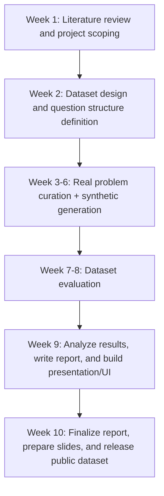

# Timeline of the project

```mermaid
flowchart TD
    A[Week 1: Literature review and project scoping] --> B[Week 2: Dataset design and question structure definition]
    B --> C[Week 3-6: Real problem curation + synthetic generation]
    C --> D[Week 7-8: Dataset evaluation]
    D --> E[Week 9: Analyze results, write report, and build presentation/UI]
    E --> F[Week 10: Finalize report, prepare slides, and release public dataset]
```
